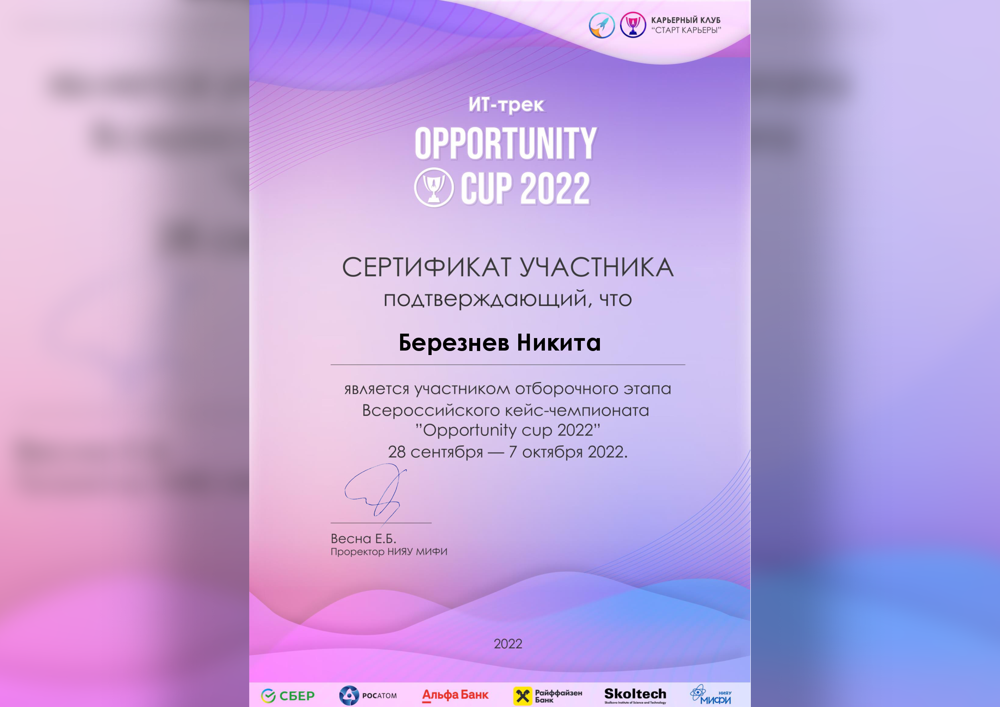
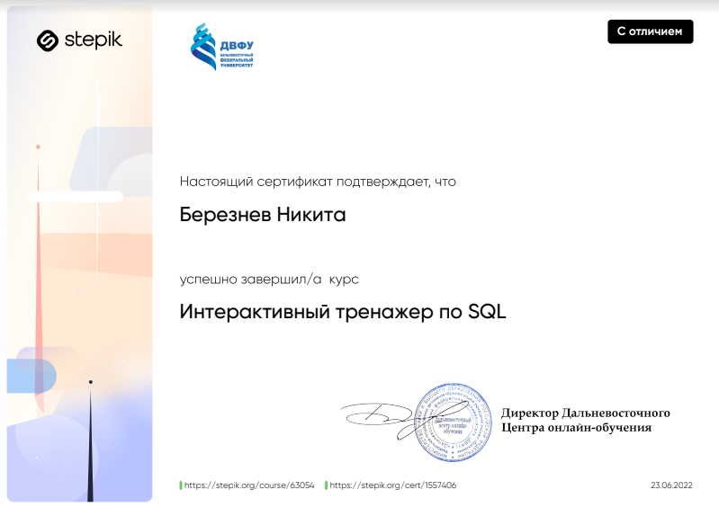
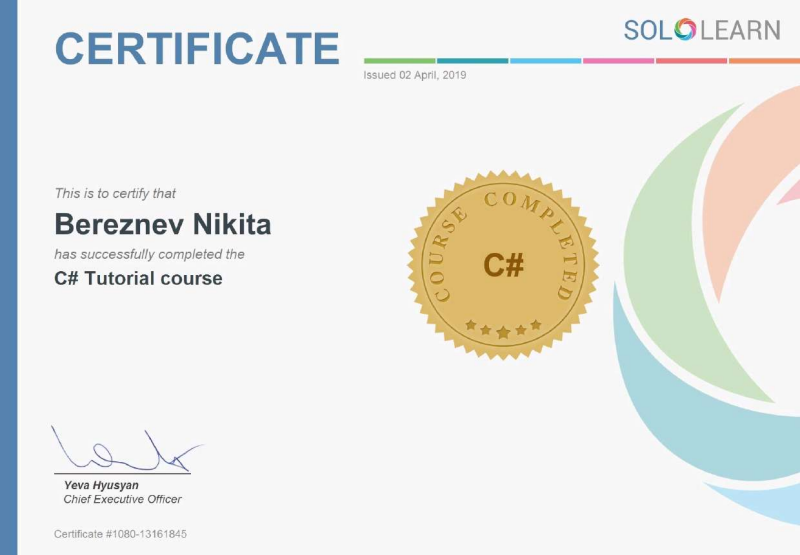

<h2 align="center">Всем привет </h2>
<h2 align="center">Меня зовут Никита. Я начинающий разработчик </h2>

---

### 🛠 Языки и Технологии:
&nbsp; &nbsp;
&nbsp; &nbsp; 
&nbsp; &nbsp;
&nbsp;&nbsp;
&nbsp; 

### 🎨 Графические редакторы:

---
### Мое образование 👨‍🎓

[Школа 21](https://21-school.ru/). Школа программирования от Сбера, франшиза французской [École 42](https://en.wikipedia.org/wiki/42_(school)).

Бакалавр [ФГБОУ ВО «КГЭУ»](https://ru.wikipedia.org/wiki/Казанский_государственный_энергетический_университет) факультет «Информатика и вычислительная техника», специальность «Программное обеспечение средств вычислительной техники и автоматизированных систем».

---

### 📜 Мои достижения (кликабельно):
|  |  |  |
|----------------------------------------------------------------------------------------------------------------------------------|------------------------------------------------------------------------------------------------------------------|---------------------------------------------------------------------------------------------------------------------------------------------------------------------------|
| Участие в IT-треке кейс-чемпионата от «НИЯУ МИФИ» и Сбера                                                                     | Сертификат о прохождении курса  «Интерактивный тренажер SQL»   на платформе Stepik                         | Cертификат о прохождении курса   «Sololearn C# Tutorial Course»                                                                                                        |
---

### 🔥 Моя статистика:
   

---
### ⚔️ Codewars

 

